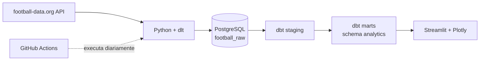

# ⚽ Analytics Futebol

Projeto de engenharia e análise de dados que coleta informações de partidas, equipes e classificações e as transforma em indicadores exploráveis para a UEFA Champions League, La Liga e Brasileirão.

> Um pipeline ELT em Python com `dlt`, PostgreSQL e `dbt`, acompanhado de um dashboard interativo em Streamlit.

## Visão geral

O projeto busca dados na [football-data.org](https://www.football-data.org/), carrega as respostas em uma camada raw no PostgreSQL e constrói modelos analíticos com dbt. O dashboard consulta os modelos finais para apresentar métricas de partidas, gols, classificações e o desempenho dos campeões na temporada seguinte.



## O que o projeto entrega

- Extração de equipes, partidas e classificações das competições `CL`, `PD` e `BSA`.
- Camada raw isolada no schema `football_raw`.
- Modelos staging com tipos e nomes padronizados.
- Marts de partidas (`fct_matches`), equipes (`dim_teams`) e acompanhamento do campeão (`champion_curse`).
- Dashboard com indicadores gerais, gols por competição, classificações e posição do campeão na temporada seguinte.
- Execução automatizada do pipeline pelo GitHub Actions.

## Tecnologias

Python · dlt · PostgreSQL · dbt · Streamlit · Pandas · Plotly · GitHub Actions · Render

## Rodar localmente

### Pré-requisitos

- Python 3.12 ou compatível com as dependências do projeto.
- Docker e Docker Compose, para subir um PostgreSQL local, ou acesso a uma instância PostgreSQL existente.
- Token da API football-data.org.

### 1. Clone e ambiente Python

```bash
git clone <URL_DO_REPOSITORIO>
cd analytics_futebol
python -m venv .venv
source .venv/bin/activate  # Windows: .venv\Scripts\activate
pip install -r requirements.txt
```

### 2. Configure o PostgreSQL e as credenciais

Para iniciar um banco local usando Docker Compose:

```bash
cp .env.example .env
docker compose up -d postgres
```

Edite `.env` e informe seu token `FOOTBALL_API_TOKEN`. O exemplo cria o banco `dbanalytics` e inclui as variáveis `PG_HOST`, `PG_USER` e `PG_PASSWORD` esperadas pelo dbt.

### 3. Execute a carga e as transformações

```bash
python run_pipeline.py
```

O comando executa, em sequência, `extraction.py`, `dbt run` e `dbt test`. A carga substitui os dados dos recursos raw a cada execução (`write_disposition="replace"`).

### 4. Inicie o dashboard

```bash
streamlit run dash.py
```

Abra o endereço local informado pelo Streamlit (normalmente `http://localhost:8501`). O dashboard usa a variável `POSTGRES_URL` para acessar o mesmo PostgreSQL.

Instruções de configuração do banco, variáveis e comandos dbt estão em [Desenvolvimento local](docs/local-development.md). Consulte também o [modelo de dados](docs/data-model.md) e as [notas de deploy](docs/deployment.md).

## Estrutura do repositório

```text
.
├── dash.py                  # Aplicação Streamlit
├── extraction.py            # Ingestão dlt para PostgreSQL
├── extraction_duckdb.py     # Variante experimental de ingestão para DuckDB
├── run_pipeline.py          # Orquestra extração e dbt
├── dbt_project/
│   ├── models/staging/       # Limpeza e padronização
│   ├── models/marts/         # Modelos analíticos
│   └── profiles.yml          # Conexão dbt/PostgreSQL via ambiente
├── flows/pipeline.py        # Fluxo Prefect (execução local configurada)
├── .github/workflows/       # Agendamento GitHub Actions
└── docs/                    # Guias operacionais e modelo de dados
```

## Próximos passos

- Adicionar testes de qualidade e cobertura para regras analíticas do dbt.
- Tornar parametrizáveis a lista de competições e os períodos de consulta.
- Publicar uma demonstração do dashboard com dados atualizados.

## Fonte dos dados

Os dados são fornecidos pela [football-data.org](https://www.football-data.org/). O acesso e a cobertura de competições dependem do plano e dos limites da API. Este projeto é independente e não é afiliado às competições ou à football-data.org.
